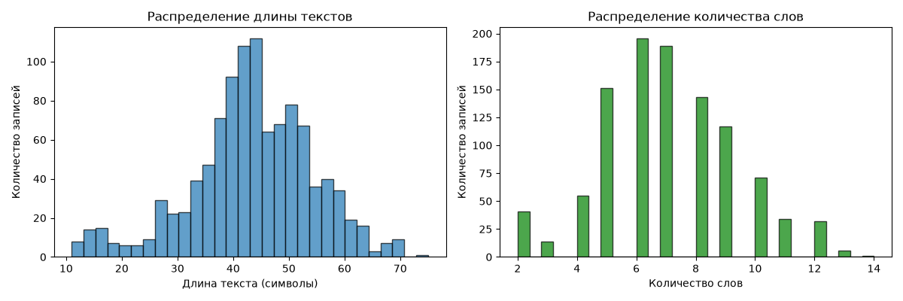
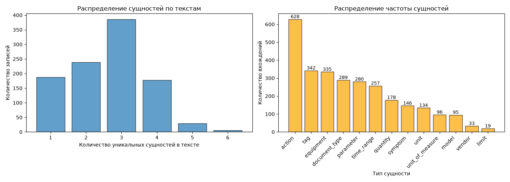
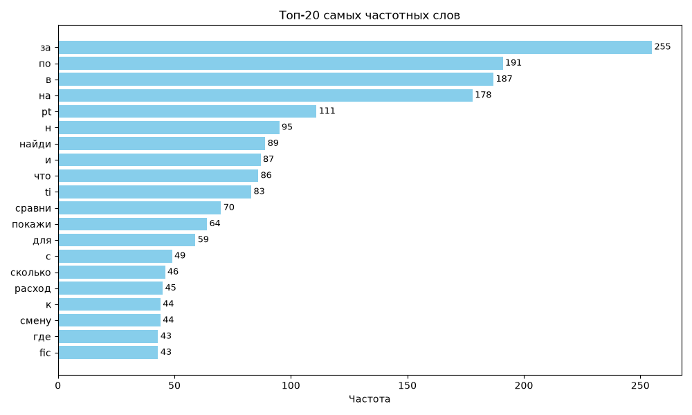
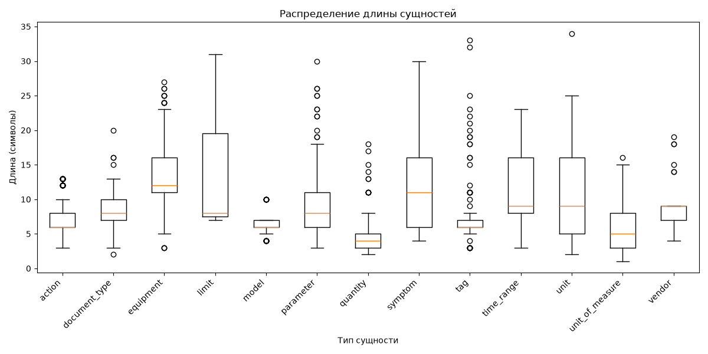

# Введение

Сегодня активно разрабатываются LLM-ассистенты, позволяющие автоматизировать различные сценарии предприятий. Они могут:
* Рассчитать значение по заданным параметрам
* Найти информацию, опираясь на базу знаний
* Работать с time-series данными
* Проводить диагностику объекта

Процесс работы подобных ассистентов можно представить следующим образом:

```
Получение пользовательского запроса
	        ↓
Обработка запроса диспетчером
            ↓
Обработка запроса соответствующим агентом
            ↓
Формирование ответа агентом  
            ↓
Отправка ответа пользователю
```

Здесь важную роль играет диспетчер (семантический роутер). Чтобы задействовать каждую модель исключительно по ее специализации, семантический роутер быстро и эффективно анализирует запрос перед выбором, кому этот запрос отправить. Весь отчет посвящен реализации семантического роутера.
# Постановка задачи

Семантический роутер состоит из двух важных независимых частей - распознавания именованных сущностей (NER) и классификации намерения с выбором агента. Таким образом, основная задача сводится к следующему:

1. Подготовить размеченный датасет для обучения моделей
2. Настроить модели экспериментальным путем
3. Провести оценку качества NER и классификации
4. Проанализировать ошибки, допущенные моделями
5. Объединить полученные результаты в единый пайплайн
6. Рассмотреть различия подходов, ограничения, составить рекомендации по использованию в реальной среде
# Описание данных

Данные представляют собой сгенерированный датасет из 1050 небольших запросов для ИИ-агента со средней длиной в 7 слов. Запросы представляют разные намерения пользователя (найти, составить, рассчитать и т.д.). Также добавлены запросы, не содержащие профессиональной терминологии, и неполные запросы, параметров которых для решения задачи окажется недостаточно. Фразы приближены к вопросам реальных пользователей, имеется небольшой шум - ошибки в словах. Примеры из датасета:

```
Выдай техническую документацию на теплообменник Т-555
Отобрази тренд давления PT-128 за 12 часов
На PT-446 было 14.5 МПа а стало 13.2 пачему
Напиши тост за нефтяников
```

Запросы содержат установки, оборудование, теги и прочую информацию, необходимую для более сложных моделей. Их извлечением занимается NER, а определением намерения - intent-классификация. Сырые данные находятся в файле raw.txt.
# Таксономия классов / сущностей

Таксономии позволяют создать строгие правила разметки, чтобы у моделей не было сомнений при обучении. К тому же это бывает полезно, когда над аннотированием работает несколько разметчиков.

**Таксономия сущностей:**

| entity_type       | description                                     | examples                                                                | annotation_rules                                                                                                                                  | edge_cases                                                                                                                                                                                                                    |
| ----------------- | ----------------------------------------------- | ----------------------------------------------------------------------- | ------------------------------------------------------------------------------------------------------------------------------------------------- | ----------------------------------------------------------------------------------------------------------------------------------------------------------------------------------------------------------------------------- |
| `unit`            | установка, цех, технологический объект, система | ЭЛОУ-АВТ, ГПЗ, УПН, трубопровод                                         | Выделять полное наименование установки вместе с буквенно-цифровым индексом.                                                                       | Если установка называется по доминирующему оборудованию (например, «печь №1»), не путать с `equipment`.                                                                                                                       |
| `equipment`       | оборудование                                    | насос Н-101, теплообменник Т-203, колонна К-1, блок сброса, трубопровод | Выделять вместе с типом оборудования и номером.                                                                                                   | Если номер не указан, выделять только тип. Если упоминается «резервный насос» — выделять как `equipment`? Да, если понятно, о каком именно насосе речь.                                                                       |
| `tag`             | технологический тег / КИП                       | датчики PT-403, TI-102, FIC-201                                         | Выделять полный идентификатор тега, включая префикс (PT, FIC) и номер.                                                                            | Если тег упоминается без префикса (просто «403»), но из контекста ясно — выделять как `tag`, добавляя префикс из ближайшего упоминания, если это возможно.                                                                    |
| `parameter`       | технологический параметр                        | давление, температура, расход, уровень                                  | Выделять только само название параметра, без численных значений и единиц.                                                                         | «Дельта давления» — выделять как `parameter` (всё словосочетание). «Параметр Х» — если Х — конкретное имя, это скорее `tag`.                                                                                                  |
| `symptom`         | симптом / наблюдаемое поведение                 | растет, падает, скачет, не открывается, выше нормы                      | Выделять глагол или фразу, описывающую отклонение от нормы.                                                                                       | Если перечислено несколько симптомов подряд  — каждый симптом выделять отдельно, даже если они связаны общим контекстом.                                                                                                      |
| `document_type`   | тип документа                                   | регламент, инструкция, паспорт, ПМИ, алгоритм                           | Выделять общее название типа документа без номера.                                                                                                | Если дана конструкция вида «по инструкции», «в регламенте» — выделять «инструкции», «регламенте» как`document_type`.                                                                                                          |
| `vendor`          | производитель / вендор                          | Yokogawa, Emerson, Siemens                                              | Выделять полное название компании. Если есть подразделение (Emerson Rosemount) — выделять как одно целое.                                         | Если это просто упоминание страны («американский производитель») — не выделять, так как нет конкретного вендора.                                                                                                              |
| `model`           | модель оборудования или прибора                 | FLXA21, TDLS200, Rosemount 3051                                         | Выделять полное буквенно-цифровое обозначение модели. Если модель включает вендора — выделять только модель, vendor отдельно.                     | Если модель не уникальна и совпадает с номером тега — уточнять по контексту. В сомнительных случаях предпочтение отдавать `model`, если речь идёт о характеристиках оборудования.                                             |
| `unit_of_measure` | единицы измерения                               | °C, МПа, м³/ч, %                                                        | Выделять как единицу измерения даже если она записана словом (проценты, метры).                                                                   | Если единица входит в состав параметра («расход в м³/ч») — выделять только саму единицу, «расход» — отдельно как `parameter`.                                                                                                 |
| `limit`           | ограничение / уставка / аварийный предел        | H, HH, L, LL, alarm limit                                               | Выделять буквенные обозначения, слова «уставка», «предел», «граница».                                                                             | Если предел выражен числом («выше 20 МПа») — выделять как `limit` вместе с числом и единицей? Нет, число и единица не входят — только сам факт ограничения («превышение», «верхняя граница»).                                 |
| `time_range`      | временной диапазон                              | за сутки, за смену, последние 2 часа                                    | Выделять всю фразу, описывающую интервал, включая предлоги и числительные.                                                                        | «Сейчас», «только что» — не выделять, это не диапазон. «Вчера» — выделять, это конкретный временной срез.                                                                                                                     |
| `action`          | действие, которое просит пользователь           | покажи, найди, сравни, рассчитай                                        | Выделять глагол, по смыслу отвечающий за запрос пользователя. Если действие выражено существительным («нужен расчёт») — выделять существительное. | Если глаголов несколько — выделять каждый. Если вопрос без действия («какое давление?») — выделять `parameter`, а `action` опускать.                                                                                          |
| `quantity`        | количество / объём                              | 100, 23, 0.5, 5 000                                                     | Выделять числовое значение отдельно, без единицы измерения. Числа, записанные прописью, тоже выделять                                             | Если число входит в состав диапазона («от 10 до 20») — выделять каждое число отдельно, а не весь диапазон целиком. Если число указано с неопределённостью («около 50», «примерно 100») — выделять вместе с уточняющим словом. |

В таксономии рассмотрены описание каждой сущности, возможные примеры, правила для разметки и пограничные случаи, которые могут вызывать неопределенность. Всего имеется 13 сущностей.

**Таксономия классов:**


# Методология разметки
## Задача NER

Разметка проводилась в Label Sudio. При этом использован rule-based pre-labelling - с помощью регулярных выражений и словарей выявлены наиболее явные сущности. Это ускорило процесс разметки, сведя задачу к проверке готовых результатов. Хотя это не использовалось, можно было внести точность для предсказаний. Это позволило бы разметчику рассматривать только те запросы, точность предсказания которых меньше заданного порога. Размеченные данные сохранены в NER_annotated.json.

Пример разметки в формате JSON:

```json
{  
  "text": "Найди инструкцыю по эксплуатации теплообменника Т-626",  
  "id": 1025,  
  "label": [  
    {  
      "start": 0,  
      "end": 5,  
      "text": "Найди",  
      "labels": [  
        "action"  
      ]  
    },  
    {  
      "start": 33,  
      "end": 53,  
      "text": "теплообменника Т-626",  
      "labels": [  
        "equipment"  
      ]  
    },  
    {  
      "start": 6,  
      "end": 16,  
      "text": "инструкцыю",  
      "labels": [  
        "document_type"  
      ]  
    }  
  ],  
  "annotator": 1,  
  "annotation_id": 1003,  
  "created_at": "2026-07-06T20:06:33.197582Z",  
  "updated_at": "2026-07-07T16:35:55.798026Z",  
  "lead_time": 54.20099999999999  
}
```
## Задача классификации


# Анализ размеченных данных 
## Задача NER

Распределение количества символов и слов в запросе близко к нормальному:



Сущности имеют явный дисбаланс - action встречается в более 50% случаев, в то время как vendor и limit - значительно реже:



Чаще всего из отдельных слов (предлогов) встречается "за", вероятно отвечающий за промежуток во времени ("за смену", "за неделю", "за час"):



На boxplot отмечено множество выбросов для tag. Это объясняется тем, что фразы, наподобие "резервный датчик", встречаются реже четкого номера тега вида XX-000.



Соотношение размеченных токенов достигает 39.08% - каждый третий токен в данных является сущностью.

**Итоговое заключение**: дисбаланс сущностей, высокая плотность сущностей на токен, крайне редкая сущность limit (менее 20 примеров).

## Задача классификации

# Baseline-подход
## Задача NER

Для baseline реализованы классические регулярные выражения, которые выявляют наибольшую долю сущностей:

* unit: шаблоны **установка-номер**, а также возможные варианты сущности без номеров ("система", "установка", "линия" и т.п.)
* equipment: шаблоны **оборудование-номер**, + "насос", "емкость", "коллектор" и т.п.
* tag и model: шаблоны **код-номер** + "тег", "датчик", "модель" и т.п.
* document_type: возможные типы документации
* action, symptom и time_range: возможные слова и конструкции, отражающие данную сущность
* limit, unit_of_measure и parameter: возможные варианты/сокращения
* vendor - список вендоров
* quantity - цифры и конструкции, предполагающие интервал

Такой подход оказался хорошим для некоторых сущностей, однако отмечено слишком много неоднозначностей и ошибок. Подробнее в отчете error_analysis.md.
## Задача классификации
# ML/LLM-подходы
## Задача NER
## Задача классификации
# Эксперименты
## Задача NER
## Задача классификации
# Метрики
## Задача NER
## Задача классификации
# Анализ ошибок
## Задача NER
## Задача классификации
# Сравнение подходов
## Задача NER
## Задача классификации
# Выводы
# Рекомендации по внедрению
# Ограничения
# Дальнейшие действия